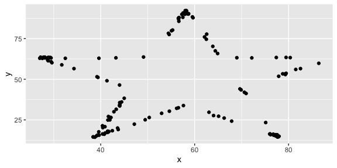

Lab 01 - Hello R
================
Steph Bossert
4 Feb 21

## Load packages and data

``` r
library(tidyverse) 
library(datasauRus)
```

## Exercises

### Exercise 1

``` r
datasaurus_dozen %>%
  count(dataset) %>%
  print(13)
```

    ## # A tibble: 13 x 2
    ##    dataset        n
    ##    <chr>      <int>
    ##  1 away         142
    ##  2 bullseye     142
    ##  3 circle       142
    ##  4 dino         142
    ##  5 dots         142
    ##  6 h_lines      142
    ##  7 high_lines   142
    ##  8 slant_down   142
    ##  9 slant_up     142
    ## 10 star         142
    ## 11 v_lines      142
    ## 12 wide_lines   142
    ## 13 x_shape      142

1)  13 rows and 2 columns

### Exercise 2

First let’s plot the data in the dino dataset:

``` r
dino_data <- datasaurus_dozen %>%
  filter(dataset == "dino")

ggplot(data = dino_data, mapping = aes(x = x, y = y)) +
  geom_point()
```

<!-- -->

And next calculate the correlation between `x` and `y` in this dataset:

``` r
dino_data %>%
  summarize(r = cor(x, y))
```

    ## # A tibble: 1 x 1
    ##         r
    ##     <dbl>
    ## 1 -0.0645

Correlation = -.065 \#\#\# Exercise 3

Add code and narrative as needed.

``` r
star_data <- datasaurus_dozen %>%
  filter(dataset == "star")

ggplot(data = star_data, mapping = aes(x = x, y = y)) +
  geom_point()
```

<!-- -->

``` r
star_data %>%
  summarize(r = cor(x, y))
```

    ## # A tibble: 1 x 1
    ##         r
    ##     <dbl>
    ## 1 -0.0630

I’m some text, you should replace me with more meaningful text…

### Exercise 4

Add code and narrative as needed. Note that two R chunks are given but
they are not labeled. Use the convention from above to name them
appropriately.

### Exercise 5

Add code and narrative as needed. To add R chunks either type out the
backticks, curly braces, and the letter `r` or use the Insert chunk
button above, green C+.
